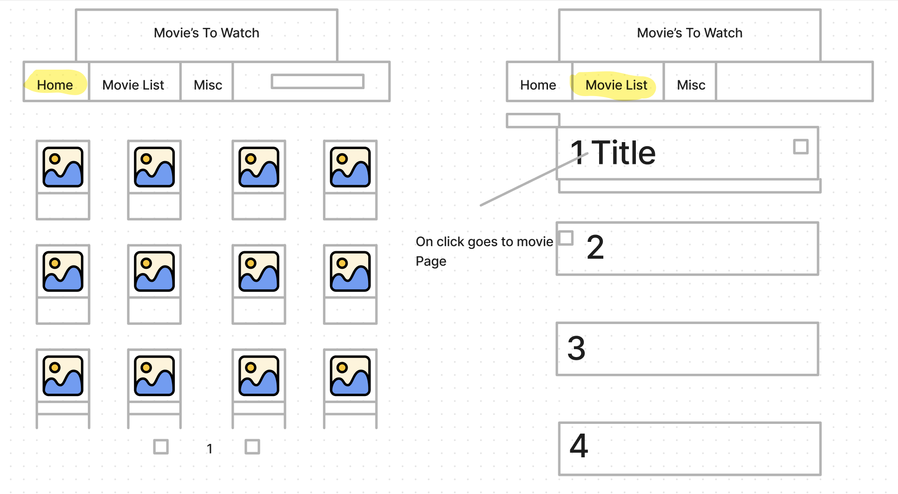

# Movies-to-Watch

### Description
This is my second project on the General Assembly’s Software Engineering Intensive program. It enables users to create, edit and update a list. API calls provide some popular movies that the user might be interested in, but there is also a search feature if the movie they want is not there.

The app is deployed on github pages, the link to the page is:
[Deployment Link](https://k-b13.github.io/Movies-To-Watch/)

We were given 4 days to work on the project and it was a solo project.

### External APIs:
* IMDb-API
* Excuser API
* ChuckNorris Joke API

### Framework and Libraries
* React
* React Router

### Languages
* HTML
* CSS
* JavaScript
* JSX

### Code version control
* Git
* Github

### Code and Debugging
* Command Line
* Visual Studio Code

### Design
* Figma

## Requirements

### General
Build a web application from scratch, without a starter codebase. Must be your own work.
Use React with the create-react-app to build your application.
Plan your application using wireframes and user stories.
Craft a README.md file that explains your app to the world.
Deploy your app online, where the rest of the world can access it.

### Technical
Select a project idea of your own. But the user must be able to:
* Add a new item to a list.
* Mark the item as complete/favourite/(watch, read, listen) later/flag/etc.
* Edit an item from a list.
* Remove an item from a list.
* Clear/delete all items.
* Clear/delete only marked items.
* Fetch data from at least one 3rd party API using * Axios of fetch.
* Make frequent git commits with descriptive messages, explaining your commit.
* Use React Router to handle multiple pages/views.

### Deployment
Your React app must be deployed to GitHub pages, Surge, or any hosting service. Applications that are not deployed will be considered incomplete.

### Bonus Requirements
You should only attempt these bonuses if and only if you’ve satisfied the base technical requirements for this project.
* Incorporate another API in your application
* Use React.Context to pass props down to your children
* Make the app Responsive
* Save the data to local storage or an API
* Use 1 or more 3rd party libraries
* Use a React component library like Any Design, Bootstrap React, or Material UI
* Use a CSS library like Bootstrap
* Add User Sign Up, Sign In, and Sign Out with Firebase and React Authentication.

## Planning

I began the planning phase by searching for an API to use. I wanted to make sure the API I used provided enough information for me to build an app around and worked how I expected. I decided to choose the API first then start planning what I wanted my project to be. That way I would ensure my API would be able to provide what I wanted it to.

Once I had decided that I wanted to use the IMDb-API, due to having extensive information available and ease of use, I set about planning my app.

I drew up a draft design of what I wanted my app to look like in Figma. I planned out the homepage and the list page.



I also thought through the features I wanted my app to have. I also had a think about how I might go about achieving the desired result. I focused on the MVP criteria at this phase as that was the priority but when the app had achieved the MVP stage I would then think about additional features I would want to add.

Homepage
Picture and title
Display all 250
useEffect - top 250 movies Link - only once 
Map through 250 to individual movie component 
Movie List
Get info from useState 
Filter when I display 
Array of objects - id, title, actors, hasWatched, rating: null
Pass through all the info that you want to display.
Have button to remove from list
Have a select button and remove selected button
A remove all button
Button to select has watched and reverse
Select ratings after the user has selected watched.

## Build/Code Process
I began the code process setting up the react app and the routes to the homepage and the Watchlist page. I also set up a state to store the movie list.

```js
  <h1>Movie's to Watchlist</h1>
  <NavBar />
  <Routes>
    <Route path="/" element={<Home moviesToWatch={moviesToWatch} addToList={addToList} 
    />}>
    <Route path="/WatchList" element={<WatchList 
     moviesToWatch={moviesToWatch} 
    />}></Route>
  </Routes>
  <main></main>
```

Once I had the initial setup complete I went about setting up a fetch request for the home page and rendering the information onto the page by mapping through the information received from the fetch request.

```js
  <div className='selection-screen'>
    { startScreen.length ? 
    startScreen.map((items) => {
      return(<DisplayMovie 
      appendMovie={props.addToList} 
      items={items} 
      key={items.id}/>)
      }) : null
    }
  </div>
```

The logic for removing single items, selecting items and removing selected items are shown above. I added 2 keys to any movie object added to the movie list state. One key was called removeMovie, which is a boolean, and if an item was changed to true the list state would be filtered so it removed the movie set to true. The other was a select key which could be toggled and when the remove selected is clicked would remove all items from the list whose selected key was true. This would allow multiple selected items to be removed at once.

```js
function removeSingle(num) {
    moviesToWatch[num].removeMovie = !moviesToWatch[num].removeMovie
    console.log(moviesToWatch)
    filterMovieList()
  }

  function removeSelected() {
    const removeMovies = moviesToWatch.filter((str) => !str.selected)
    setMoviesToWatch(removeMovies)
  }

  function selectButton(num) {
    moviesToWatch[num].selected = !moviesToWatch[num].selected
    setMoviesToWatch([...moviesToWatch])
  }
```

I realised I wanted the user to have a way to rate the movies that they had watched. Also I wanted this feature to be the traditional star system that is common with movie rating systems.

```js
{[...Array(5)].map((star, index) => {
      index +=1
      return (
        <button
        type="button"
        key={index}
        className={index <= (hover || rating ) ? "rating-on": "rating-off"}
        onClick={() => {
          return(
            setRating(index)
          )
        }
        }
        onMouseEnter={() => setHover(index)}
        onMouseLeave={() => setHover(rating)}
        onDoubleClick={() => {
          setRating(0);
        }}
        >
        <span className='star'> &#9733;</span>
        </button>
      );
    })}
```

Above is the setup for the star rating system. FIrst an array of numbers 1-5 is created. If the index of the stars is less than the hover, rating or already input starScore then the stars className will be set to ‘on’ (this class name will colour the stars in yellow) and if the index is greater than the rating, hover or starScore then it will not be filled in. I was pleased with how this feature turned out as it looks really good and functionally it works as intended.

I added in an individual movie screen page which would display more information to the user. I used dynamic routing to achieve this through the use of the useParams hook. When the user clicks on one of the movies, that movie's ID would be added on the URL and then it would be fetched from there by the useParams hook. The movie id was then used in the fetch request to gain the additional information as the fetch request for the top 250 on the homepage had limited data and I needed to do another search to gain more for the individual page display.

```js
  const { idCode } = useParams()
  const [ movieInfo, setMovieInfo ] = useState([])
  const [ isInList, setIsInList ] = useState(false)
  useEffect(() => {
    fetch(`https://imdb-api.com/en/API/Title/k_sn8009mj/${idCode}`)
    .then((response) => response.json())
    .then((result) => {
    setMovieInfo(result)})
}) 
```

The app was working well but users could only add movies that were in the top 250 movies on IMDb which is very limited. So I wanted to add a search feature so that users could search for other movies. I had some difficulty setting up the search feature in the nav bar and with limited time for the project I opted to have the search bar on its own page which differed from the original design. 
Also I added in local storage to the app as I realised what good would a list be if it reset every time the user came back to it. This was quite straightforward as the only information that needed to be saved was the movie list state. I used a useEffect that would save the list to local storage whenever it changed.

After the search bar was complete, I worked on the final MVP feature I needed to add, which was the edit feature. I enabled the user to edit the plot after they had added the movie to their list. The plot on the movie page would be solid text if the movie isn’t on their list, but, if they click to add it to their list then the plot would change to an input box.

```js
function changePlot(e, plotText) {
    e.preventDefault()
    const movieList = JSON.parse(localStorage.getItem('moviesToWatch'))
    const updatedMovieList = movieList.map((movie) =>  {
      if(movie.id === props.movieInfo.id) {movie.userDescription = plotText}
      return movie 
    })
    
    localStorage.setItem(`moviesToWatch`, JSON.stringify(updatedMovieList))
    setInputValue(plotText)
  }
```

## Challenges

* Early on I experienced some difficulty with my API as I accidentally used up all my API calls due to accidentally creating an infinite loop making fetch requests. In the future, I will store the information from the API in a data file in case I encounter a similar issue in the future.

* I had difficulty getting the search bar to work in the nav bar and ended up having to create a separate page for it.

* I also had a lot of difficulty with getting the app deployed. I overlooked local storage as I was populating my movie list from local storage and while testing it locally I had always had something in local storage. However, after deploying the list was crashing due to there being nothing in local storage which caused problems as you cannot map over null.


## Wins

* I was happy with the inclusion of local storage as it was my first time using it.

* I had some difficulty implementing the edit feature but am happy with how it turned out in the end.

## Key Learnings/Takeaways

* Be careful when setting up API calls to make sure there is not an infinite loop.
* Also if local storage is being used, be careful how it is being implemented as it can cause potential problems if not used properly.
* I certainly feel a lot more comfortable with the React framework than I did before the project.

## Bugs

* There is a slight bug with the edit feature where if you add it to the list and then edit it on the individual movie page, before going to the movie list. Then when you click to view the plot it resets the movie plot to the original plot.

## Future Improvements

* In the future I intend to add a way to reorganise the list, probably in the form of a drag system.
* I also plan to add a feature where if a movie from the homepage is added to the list it no longer displays on the homepage.
* I also wanted to add pagination to the homepage to improve load speed and not have so much on one page.


